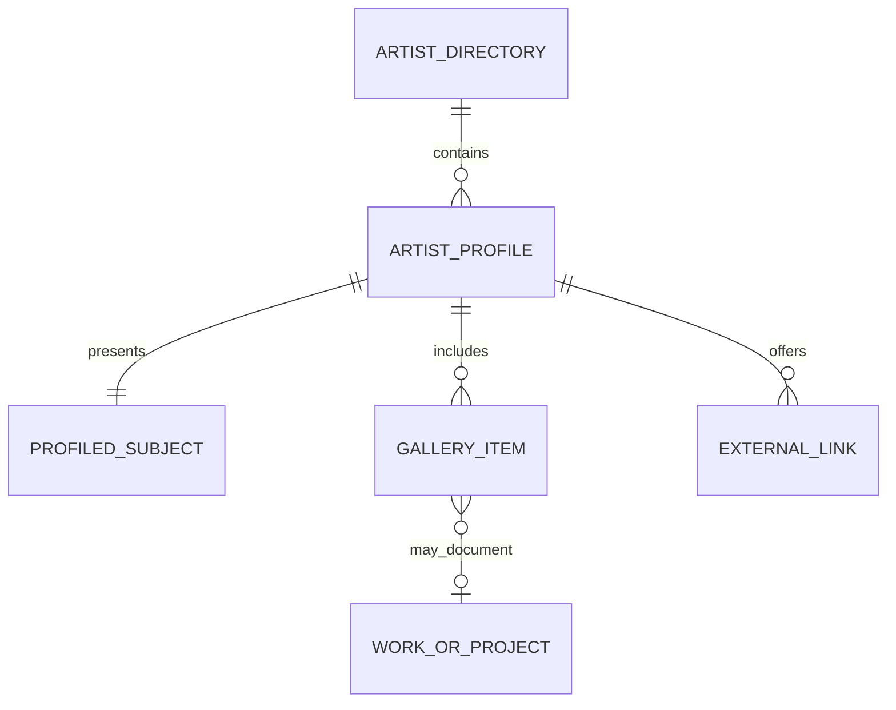

# Artist network expansion

This is a lightweight decision record for expanding the current seven-entry artist registry. It does not authorise a new interface, promote `/artists/` in navigation, or define artists' work without input from the Tarski team.

## Orientation

The audit is based on the current repository and published content. It is not a substitute for artist, visitor or team research.

| Layer | State | Evidence and risk |
| --- | --- | --- |
| Observed behaviour | Assumed | The repository contains analytics, but no findings about how people discover or compare artists. |
| Domain | Partial | The mission and practices are described well; “network”, artist, collective and participation are not operationally defined. |
| User needs | Assumed | Discovering a practitioner, understanding their practice and following their links are inferred from the interface rather than validated. |
| Product strategy | Partial | Tarski's position is clear, but the future role of the directory versus the homepage network section is undecided. |
| Conceptual model | Weak | People, collectives and institutions share one implicit shape; works, projects and documentation are not distinguished. |
| Interaction structure | Partial | The homepage dossier and static profile routes work, but there is no agreed scaled route for a larger cohort. |
| Surface | Strong | The UI, spacing, corner, motion, accessibility and release rules are documented and tested. |

The foundational evidence gap is **observed behaviour**. Do not hide it by inventing research findings. The immediate delivery bottleneck for a known incoming cohort is the **conceptual model**: without an explicit subject type and publication boundary, every new profile makes the content and generator harder to evolve.

## Domain residue

This is the model currently expressed by the team and site copy, not verified domain truth.

| Concept | Current meaning | Unresolved language |
| --- | --- | --- |
| Artist | A person with an artistic practice; also used as the umbrella catalog label. | Does “Artists” intentionally include collectives and institutions in every context? |
| Artistic collective or institution | A group presented alongside individual artists. | Is it a type of network participant, an artist, or a separate category? |
| Practice | What a person or group does and the context in which they work. | Currently embedded in role and biography rather than represented separately. |
| Work / project / artistic situation | An outcome or process connected to a practice. | These words may name different things; the site currently does not model the distinction. |
| Documentation | Media that records a person, practice, work or event. | The current “Works and documentation” gallery deliberately combines several meanings. |
| Network | The editorial grouping shown by Tarski. | Membership, current collaboration and editorial selection must not be treated as synonyms until the team defines the relationship. |
| Participation | Both a quality of participatory art and a way to engage with Tarski. | Keep “participation in an artistic practice” distinct from “participation in Tarski”. |

Programmes, events, residencies and partnerships remain outside the artist expansion unless real incoming material requires users to navigate or revisit them as independent objects.

## Minimum conceptual model

### Decisions that are safe now

- **Artist directory** is a collection of published profiles. It must not imply formal or permanent membership until “network” is defined.
- **Artist profile** is the public presentation of exactly one profiled subject.
- **Profiled subject** has an explicit kind: `person`, `collective`, or `institution`. Public headings may still use the established umbrella “Artists” with an explanatory description.
- A profile contains localized name, role and biography; display media; optional external links; and an optional gallery.
- **Gallery item** is media with accessible description and optional caption or credit. It may document the subject or a provisional work/project; it is not automatically a first-class Work.
- RU, EN and JA are representations of the same profile, not separate profiles.

`WORK_OR_PROJECT` remains **provisional**. Make it first-class only if a real job requires a titled work/project to persist, be linked from several profiles, have its own page or be returned to independently.

### Model debt to resolve before bulk onboarding

- Subject kind is currently inferred by hard-coded artist keys when structured metadata is generated. Replace that inference with an explicit registry field after the team confirms the accepted kinds.
- Publication and homepage featuring are currently the same practical set. For a larger cohort, decide whether `published` and `featured on homepage` are separate editorial decisions.
- Decide the temporal meaning of the network relationship: if collaboration ends, is a profile archived, retained as history, or removed? Never silently reuse a profile slug.

## Interaction structure

### Current stable route

**Homepage — Network**

- choose a name → artist dossier dialog
- switch between names and list views → same section
- open an external link → artist-controlled destination
- continue scrolling → participation footer
- content: seven names, previews and short profile material

**Artist dossier dialog**

- close → originating name with focus returned
- follow an external link → artist-controlled destination
- direct `#artist-*` URL → same dossier
- content: image, name, role, biography, optional gallery and links

The generated `/artists/` directory and profile pages exist, but they are not currently promoted as the main route. Keep this state until the scaled route is approved.

### Candidate scaled route — not yet authorised

**Homepage — Network preview**

- choose a featured name → dossier preview
- open full profile from the dossier → artist profile
- open all artists → artist directory
- content: a deliberate subset or compact overview, not an accidental list of every registry entry

**Artist directory**

- choose a profile → artist profile
- change language → same directory in that locale
- return home → homepage network section
- content: every published profile, with kind expressed only when it helps understanding

**Artist profile**

- return to directory → artist directory
- change language → the same profile in that locale
- follow an external link → artist-controlled destination
- return home → homepage network section
- content: the complete published profile

Required edges:

- A profile without a gallery remains complete if its core text and display image are approved; omit the empty gallery.
- Omit an empty external-links group.
- Missing required locale content, accessible media text or publication permission blocks publication.
- Direct profile URLs and existing direct dossier hashes must remain meaningful.
- If a profile is retired, preserve a deliberate historical or replacement route rather than leaving an unexplained broken URL.

## Intake gate for the next cohort

Collect this before changing the interface:

1. Approved public name and subject kind (`person`, `collective`, or `institution`).
2. The team's exact description of the subject's relationship to the Tarski network.
3. Role and biography source text, plus approved RU, EN and JA versions.
4. Display image, alternative text, credit, dimensions and publication permission.
5. Optional links, each with its destination and public label.
6. Optional gallery media, each with alternative text, caption/title where meaningful, credit and permission.
7. Whether any named work/project must be independently navigable rather than presented as gallery documentation.

## Decisions required from the team

1. Does “network” mean formal membership, current collaboration, or editorial selection?
2. Are all incoming subjects people, or will the cohort include collectives and institutions?
3. Are practitioner profiles sufficient, or must works/projects become independent objects and routes?
4. With roughly 24 profiles, should the homepage show everyone or a curated preview leading to `/artists/`?
5. What is the minimum publishable profile, and may an incomplete profile ever be public?

## Stopping rule and next move

Do not redesign the homepage network, promote `/artists/`, or add first-class work pages until the five team decisions are answered and at least two representative profile packages are available (ideally one person and one collective/institution, including one sparse gallery case).

After that evidence arrives: update the registry model first, then the generator and its tests, import content, breadboard the approved route, and only then design its surface using `docs/ui-system.md` and `docs/release-checklist.md`.
